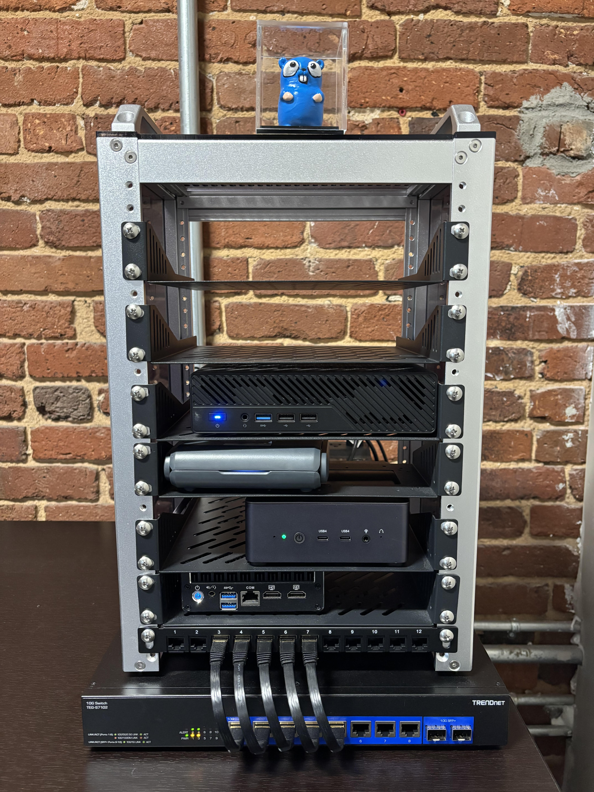

# Todo Platform

A production-style Todo platform demonstrating DevOps/ChatOps/MLOps: design, build, deploy, observe.

**Quick Links:**
[Documentation](docs/) | [Architecture](#architecture) | [About This Lab](#about-this-lab) | [How This Runs](#how-this-demo-runs) | [Deployment](docs/docs/deployment/kubernetes.md) | [Key Takeaways](#key-takeaways)

---

## Architecture

A compact, production-ready stack built for reliability, observability, and safe deployments:

- **Services**: Go todo-api, Go todo-mcp (Model Context Protocol server), Python Slack bot, Python CLIs
- **Infrastructure**: Kubernetes (K3s), GitOps with ArgoCD
- **Observability**: OpenTelemetry traces/metrics, Loki centralized logs, Prometheus + Grafana dashboards
- **Storage/Database**: PostgreSQL with CloudNativePG (CNPG), automated S3/MinIO backups, point-in-time recovery (PITR) ready
- **Security**: Cloudflare Access for zero-trust auth
- **CI/CD**: GitHub Actions self-hosted runners (ARC) -> Docker build/push -> Kustomize updates -> ArgoCD sync -> Slack #builds notifications

See [Deployment Documentation](docs/docs/deployment/kubernetes.md) for detailed architecture diagrams and workflows.

---

## About This Lab

**Purpose:** Build a realistic, reproducible environment to practice production operations end-to-end (design -> code -> CI/CD -> K8s -> observability -> rollback).



### What It Demonstrates

- **Designing small, composable services**: Services communicate through well-defined contracts (REST APIs, OpenAPI specs). The todo-mcp server implements the Model Context Protocol, enabling AI assistants to interact with the todo platform through standardized tools and schemas.

- **Shipping with rollback strategies**: Blue-green deployments(TODO).

- **ChatOps for safe, auditable deployments**: Slack commands (`/deploy`, `/rollout status`) provide visibility and control(TODO). All deployment actions are logged to the #builds channel with full context: version, status, and links to workflow runs.

- **Operability first**: Traces, metrics, and logs are correlated by service and version. Alerts include context (traces, runbooks) so responders can act quickly. Every service exports Prometheus metrics and OTEL traces. (TODO)

- **Data safety**: Automated daily backups to S3-compatible storage (MinIO), point-in-time recovery tested and documented. Database schema changes are tracked and reversible.(TODO)

### Why a Homelab?

It lets me iterate faster, test failure modes safely, and document choices transparently—skills I carry into team environments. Running this on my own hardware means I can:
- Simulate failures
- Test disaster recovery procedures without risk
- Experiment with new tools and patterns before proposing them
- Maintain full control over cost and resources

---

## How This Demo Runs

A practical view of key operations:

| Operation | Command / Flow |
|-----------|---------------|
| **Build** | `cd services/todo-api && go build` |
| **Release (CI)** | Push to `main` -> GitHub Actions builds image -> pushes to DockerHub -> updates Kustomize -> ArgoCD syncs |
| **Deploy (ChatOps)** | In Slack: `/deploy todo-api v1.2.3` -> triggers rollout -> posts status link to #builds |
| **Observe** | Grafana dashboards (service health, metrics) -> Tempo/New Relic for distributed traces -> Loki for log aggregation |
| **Backup/Restore** | Scheduled CNPG backups to S3/MinIO (daily 2 AM) -> PITR via recovery cluster |
| **Load test** | `k6 run k6/todo-api/todo-api-load-test.js` |

---

## What to Review First

For hiring managers and technical reviewers, start here:

1. **[Architecture & Deployment Flow](docs/docs/deployment/kubernetes.md)** - Detailed mermaid diagrams showing GitOps workflow
2. **[Development Setup Guide](docs/docs/development/getting-started.md)** - How to run services locally, hot reloading with Air, Python venv setup
3. **[GitHub Actions Workflows](.github/workflows/)** - CI/CD pipelines for building, testing, and deploying services
4. **[Kubernetes Manifests](deploy/applications/)** - Kustomize overlays , resource limits
5. **[MCP Server Implementation](services/todo-mcp/)** - Model Context Protocol server enabling AI assistant integration

---

## Key Takeaways

What this repository demonstrates about my approach to production systems:

- **End-to-end delivery** with rollback controls and ChatOps visibility
- **Observable by default**: every service exports traces, metrics, and structured logs
- **Secure by default**: Cloudflare Access, no hardcoded credentials
- **Data-safe**: automated backups, tested restore procedures(TODO), point-in-time recovery capability
- **Contract-driven development**: OpenAPI specs + generated clients prevent API drift and enable rapid iteration
- **GitOps discipline**: all changes tracked in Git, automated syncing, immutable deployments
- **Progressive delivery**: blue-green strategies
- **Self-service operations**: Slack bots and CLI tools empower teams to deploy, observe, and troubleshoot independently

---

## Repository Structure

```
.
├── .github/workflows/       # CI/CD pipelines: build, test, deploy, notify
├── apps/
│   └── todops-cli/         # Python CLI for platform operations (Loki search, ignore lists, Slack)
├── services/
│   ├── todo-api/           # Go REST API with OTEL, /metrics, PostgreSQL
│   ├── todo-mcp/           # Go MCP server (Model Context Protocol)
│   └── todo-bot/           # Python Slack bot (/deploy, /rollout, /todo commands) - (TODO)
├── clients/
│   └── todo-client-go/     # Generated Go client from OpenAPI spec
├── deploy/
│   ├── applications/       # Kustomize overlays per service
│   ├── argocd-apps/        # ArgoCD Application manifests (app-of-apps)
│   ├── bootstrap/          # Cluster bootstrap automation scripts
│   └── infrastructure/     # Infrastructure services (CNPG, Prometheus, Loki, MinIO)
├── docs/                   # MkDocs documentation site
│   ├── docs/
│   │   ├── development/    # Getting started
│   │   └── deployment/     # Kubernetes, GitOps
│   └── mkdocs.yml
├── infra/
│   ├── homer/              # Homer dashboard service
│   ├── runner/             # Custom GitHub Actions runner image (ARC)
│   └── dagu/               # Dagu workflow orchestrator
├── k6/
│   └── load.js             # Load testing scenarios with SLO validation
└── CLAUDE.md               # AI assistant guide to this repository
```

---

## Getting Started

### Prerequisites

- Go 1.21+
- Python 3.11+
- Docker
- kubectl (for K8s cluster interaction)

### Quick Start

1. **Run todo-api locally:**
   ```bash
   cd services/todo-api
   cp .env.example .env
   # Edit .env with local PostgreSQL credentials
   go run main.go
   ```

2. **Set up todops CLI:**
   ```bash
   cd apps/todops-cli
   python3 -m venv venv
   source venv/bin/activate
   pip install -e .
   todops --help
   ```

3. **Deploy to Kubernetes:**
   See [Deployment Documentation](docs/docs/deployment/kubernetes.md)

---

## Documentation

Full documentation is available in the [docs/](docs/) directory:

- **[Getting Started](docs/docs/development/getting-started.md)** - Local development setup for Go and Python
- **[Kubernetes Deployment](docs/docs/deployment/kubernetes.md)** - GitOps workflow, ArgoCD, self-hosted runners

---

## Technology Stack

**Core Services:**
- Go (Gin, GORM, OTEL SDK)
- Python (Click, Slack SDK, Minio client)

**Infrastructure:**
- Kubernetes (K3s)
- ArgoCD (GitOps)
- CloudNativePG (PostgreSQL operator)

**Observability:**
- OpenTelemetry (traces, metrics)
- Prometheus + Grafana
- Loki + Fluent Bit
- New Relic

**CI/CD:**
- GitHub Actions
- Actions Runner Controller (ARC)
- Kustomize
- Docker / DockerHub

**Storage:**
- PostgreSQL (CNPG with HA)
- MinIO (S3-compatible object storage)

---

## License

This project is built for demonstration and learning purposes. Major OSS components used:
- Kubernetes, ArgoCD, Prometheus, Grafana, Loki (Apache 2.0)
- Go, Python (various OSS licenses)
- CloudNativePG (Apache 2.0)

---

## Contact

Built by [scottseo.tech](https://docs.scottseo.tech) (TODO-update link) to demonstrate production-ready platform engineering practices.
