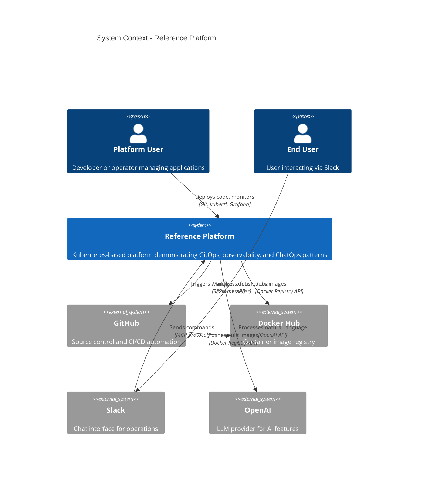
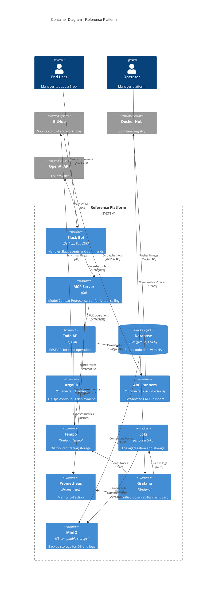
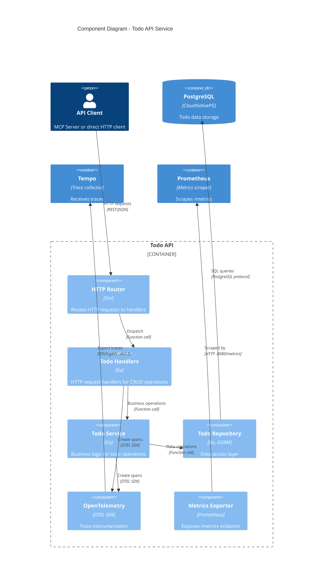
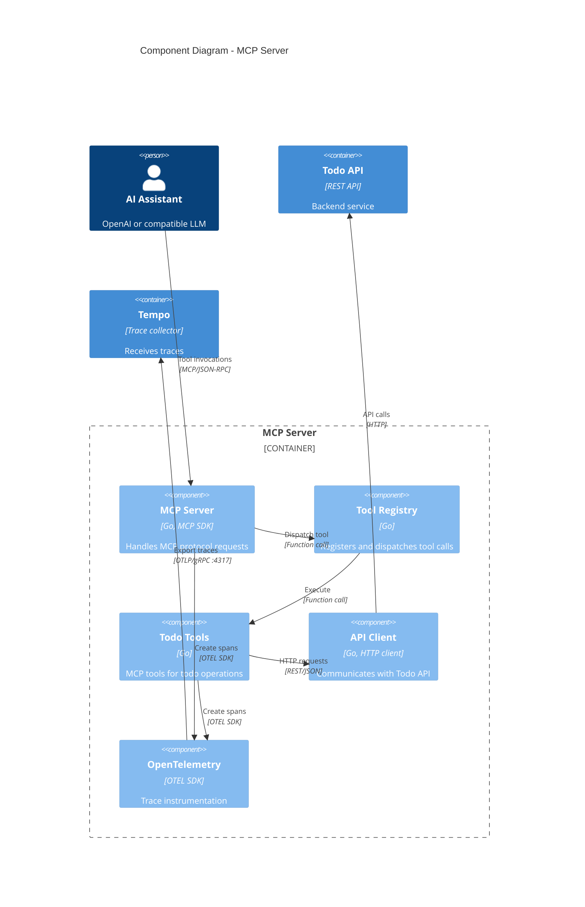
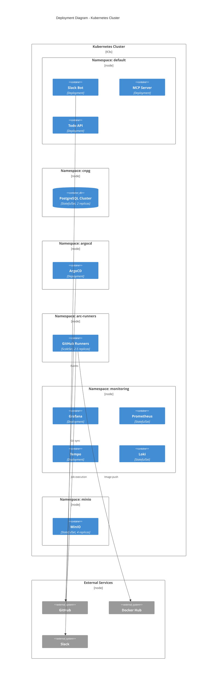

# C4 Architecture Diagrams

!!! tip "Best Viewed in Light Mode"
    For optimal visibility of diagram labels and relationship text, switch to light mode using the theme toggle in the header (☀️/🌙 icon).

## About C4 Model

The **C4 model** provides a hierarchical approach to documenting software architecture through four levels of abstraction: Context, Containers, Components, and Code. These diagrams help visualize the system at different zoom levels—from high-level system landscape to detailed component interactions.

This platform uses C4 diagrams to demonstrate:

- How external systems interact with the platform (Context)
- What containers (deployable units) make up the system (Containers)
- How components within services are organized (Components)

---

## Level 1: System Context

The highest level view showing how the Reference Platform fits into the broader ecosystem.

**Key Interactions:**

- Users deploy via Git → GitHub Actions → ArgoCD → Kubernetes
- End users interact via Slack → MCP Server → REST API
- Platform pulls images from Docker Hub for deployments
- LLM processes natural language commands through OpenAI

---

## Level 2: Container Diagram

Shows the high-level technical building blocks (containers) that make up the platform.

**Key Containers:**

- **Application Services**: Slack Bot, MCP Server, Todo API
- **Data Storage**: PostgreSQL (CNPG), MinIO
- **Platform Services**: ArgoCD, ARC Runners
- **Observability**: Tempo, Loki, Prometheus, Grafana

---

## Level 3: Component Diagram - Todo API

Detailed view of components within the Todo API service.

**Component Responsibilities:**

- **Router**: Request routing with middleware (CORS, logging, recovery)
- **Handlers**: HTTP-specific logic, request validation, response serialization
- **Service**: Business rules, transaction management, error handling
- **Repository**: Database queries, ORM mapping, connection pooling
- **OpenTelemetry**: Span creation, context propagation, trace export
- **Metrics**: Prometheus metrics (request counts, latencies, errors)

---

## Level 3: Component Diagram - MCP Server

Detailed view of components within the MCP Server.

**Component Responsibilities:**

- **MCP Server**: Protocol handling, JSON-RPC transport, tool discovery
- **Tool Registry**: Tool registration, validation, dispatch
- **Todo Tools**: MCP tool implementations (add, list, complete, delete todos)
- **API Client**: HTTP client with retry logic, timeout handling
- **OpenTelemetry**: Trace context extraction/injection, span lifecycle

---

## Deployment Diagram

Shows how containers are deployed to infrastructure.

**Deployment Characteristics:**

- **High Availability**: Database with 2 replicas, auto-failover
- **Auto-Scaling**: ARC runners scale 2-5 based on job queue
- **Resource Isolation**: Separate namespaces for different concerns
- **StatefulSets**: Used for databases and storage requiring persistent volumes
- **Deployments**: Used for stateless application services

## Benefits of C4 Diagrams

**For this platform:**

- **Context**: Shows how external systems integrate (GitHub, Slack, OpenAI)
- **Containers**: Reveals the microservices architecture and infrastructure services
- **Components**: Demonstrates internal service organization and patterns
- **Deployment**: Illustrates Kubernetes topology and scaling characteristics

**For recruiters/engineers:**

- Hierarchical views from business context to technical detail
- Clear separation of concerns across namespaces
- Observable patterns: tracing, metrics, logging flows
- Production patterns: HA databases, auto-scaling, GitOps

## Related Documentation

- [Architecture Overview](overview.md)
- [Architecture Decision Records](adr.md)
- [Deployment Documentation](../deployment/kubernetes.md)
- [Observability Stack](../observability/observability.md)
