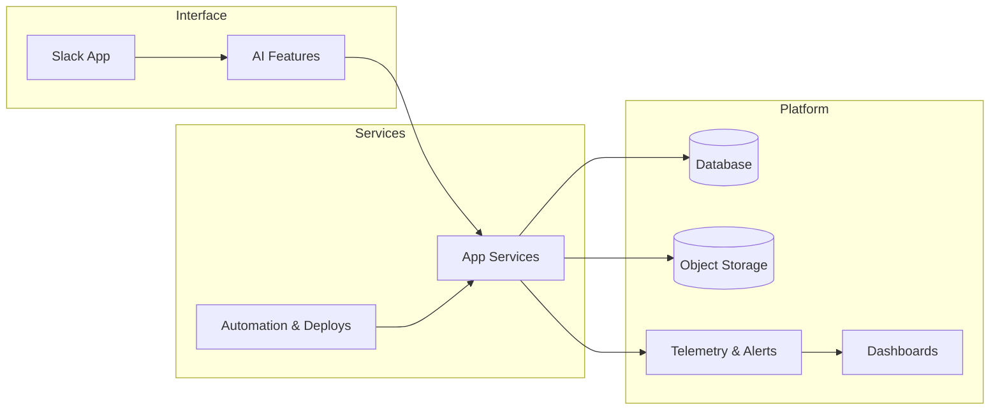

# Architecture

```mermaid
graph LR
  subgraph Interface
    Slack[Slack App]
    UX[AI Features]
  end

  subgraph Services
    API[App Services]
    Orchestrator[Automation & Deploys]
  end

  subgraph Platform
    Data[(Database)]
    Storage[(Object Storage)]
    Telemetry[Telemetry & Alerts]
    Dashboards[Dashboards]
  end

  Slack --> UX
  UX --> API
  Orchestrator --> API
  API --> Data
  API --> Storage
  API --> Telemetry
  Telemetry --> Dashboards
```