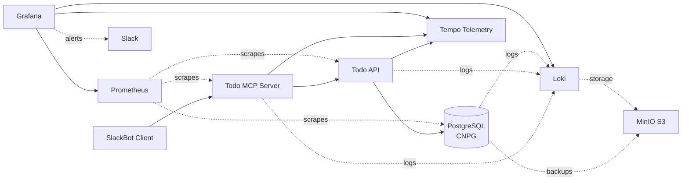

# Architecture Overview

The Todo Platform is a cloud-native Kubernetes application demonstrating production-ready DevOps practices including GitOps, comprehensive observability, and automated database operations.

## System Architecture

## Application Layer

### SlackBot Client
AI assistant integration using the Model Context Protocol (MCP). Users interact with todos through natural language in Slack, with requests routed through the MCP server.

### Todo MCP Server

MCP server providing AI-friendly tool interfaces for todo operations. Implements the full MCP specification including:

**Tools** - Four core operations:

- `todos-add` - Create new todos
- `todos-list` - Query existing todos
- `todos-update` - Modify todo status/details
- `todos-delete` - Remove todos

**Resources** - Dynamic todo data exposure:

- `todos://with-due-date` - Real-time todo list with due date as structured resource

**Prompts** - Pre-configured interaction templates for AI assistants:

- `todos-add` - Guided prompt for creating new todos with proper context
- `todos-update` - Guided prompt for updating existing todos

Prompts demonstrate full MCP specification compliance and can be tested directly in VS Code with GitHub Copilot's MCP integration.

Built with Go, supports both HTTP and SSE transports, and instrumented with OpenTelemetry for distributed tracing.

### Todo API

RESTful API service built with Go and the Gin framework. Provides CRUD endpoints for todo management with:

- GORM ORM for database operations
- OpenTelemetry instrumentation for traces
- Automatic Prometheus metrics exposure
- Database connection pooling

### PostgreSQL (CloudNativePG)

High-availability PostgreSQL cluster managed by the CloudNativePG operator:

- 2-instance cluster for redundancy
- Automated daily backups to MinIO S3 (2 AM UTC)
- Point-in-time recovery capability
- Read-write service: `todo-db-rw.cnpg.svc.cluster.local`

## Observability Stack

The platform implements the three pillars of observability with full integration:

### Metrics - Prometheus

Scrapes metrics from all services every 15 seconds:

- **Todo MCP Server**: Request rates, latency, tool invocations
- **Todo API**: HTTP request metrics, database connection pool stats
- **PostgreSQL**: Database performance, replication lag, query statistics

### Traces - Tempo

Collects distributed traces via OpenTelemetry:

- End-to-end request tracing from SlackBot → MCP → API → Database
- W3C Trace Context propagation
- OTLP gRPC ingestion (port 4317)
- Trace correlation with logs and metrics

### Logs - Loki

Centralized log aggregation with S3 storage:

- Collects structured logs from all services
- Fluent Bit agents for log shipping
- MinIO S3 backend for long-term retention
- Full-text search and filtering in Grafana

### Grafana

Unified observability dashboard:

- Queries Prometheus for metrics visualization
- Queries Tempo for trace exploration
- Queries Loki for log analysis
- Alert routing to Slack for critical events
- Correlation between traces, metrics, and logs

## Storage Layer

### MinIO S3

S3-compatible object storage serving dual purposes:

- **PostgreSQL Backups**: Daily CNPG automated backups with retention policies
- **Log Storage**: Loki long-term log retention

## Data Flows

### Request Flow

1. User sends natural language command via SlackBot
2. MCP Server interprets intent and invokes appropriate tool
3. Tool handler makes HTTP request to Todo API
4. API validates request and executes database operation
5. Response flows back through MCP to Slack

### Observability Flow

- **Traces**: Each request generates spans across MCP → API → Database, collected by Tempo
- **Metrics**: Prometheus scrapes all services, storing time-series data
- **Logs**: Fluent Bit ships logs to Loki, which stores in MinIO
- **Alerts**: Grafana evaluates alert rules and notifies Slack on threshold violations

### Backup Flow

- CNPG operator performs daily PostgreSQL backups
- Backup data compressed and encrypted
- Pushed to MinIO S3 with configurable retention
- Point-in-time recovery available from backup archives