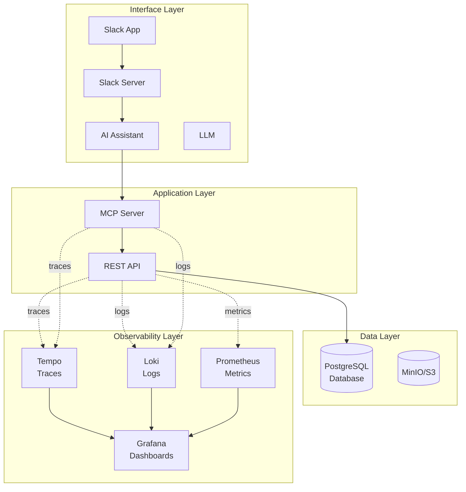

# Architecture Overview

The Todo Platform is a cloud-native Kubernetes application demonstrating production-ready DevOps practices including GitOps, comprehensive observability, and automated database operations.

!!! tip "Tip"
    Click the node description to jump to the detailed explanation section.

## System Architecture

## Interface Layer

The interface layer provides user-facing access to the todo platform through AI-powered natural language interaction via Slack.

??? note "Show more details"
    **Components:**

    - **Slack App** - User-facing Slack application where users send natural language commands and receive responses
    - **Slack Server** - Slack's infrastructure that receives events and routes messages between users and the AI assistant
    - **AI Assistant** - Intelligent agent that interprets user intent, invokes MCP tools, and formats responses in natural language
    - **LLM** - Large language model that powers the AI assistant's natural language understanding and generation capabilities

    **User Flow:**

    1. User sends a message in Slack (e.g., "Add buy groceries to my todo list")
    2. Slack Server forwards the event to the AI Assistant
    3. AI Assistant uses the LLM to interpret the user's intent
    4. LLM determines which MCP tool to invoke (e.g., `todos-add`)
    5. AI Assistant calls the MCP Server with structured parameters
    6. Response flows back through the AI Assistant, which formats a natural language reply
    7. User receives the result in Slack

    This architecture enables users to manage todos through conversational AI without needing to learn commands or syntax.

## Application Layer

### Todo MCP Server

??? note "Show more details"
    MCP server providing AI-friendly tool interfaces for todo operations. Implements the full MCP specification including:

    **Tools** - Four core operations:

    - `todos-add` - Create new todos
    - `todos-list` - Query existing todos
    - `todos-update` - Modify todo status/details
    - `todos-delete` - Remove todos

    **Resources** - Dynamic todo data exposure:

    - `todos://with-due-date` - Real-time todo list with due date as structured resource

    **Prompts** - Pre-configured interaction templates for AI assistants:

    - `todos-add` - Guided prompt for creating new todos with proper context
    - `todos-update` - Guided prompt for updating existing todos

    Prompts demonstrate full MCP specification compliance and can be tested directly in VS Code with GitHub Copilot's MCP integration.

    Built with Go, supports both HTTP and SSE transports, and instrumented with OpenTelemetry for distributed tracing.

### Todo Rest API

??? note "Show more details"
    RESTful API service built with Go and the Gin framework. Provides CRUD endpoints for todo management with:

    - GORM ORM for database operations
    - OpenTelemetry instrumentation for traces
    - Automatic Prometheus metrics exposure
    - Database connection pooling

## Data Layer
### Backup Flow

- CNPG operator performs daily PostgreSQL backups
- Point-in-time recovery available from backup archives

### PostgreSQL Database
??? note "Show more details"
    High-availability PostgreSQL cluster managed by the CloudNativePG operator:

    - 2-instance cluster for redundancy
    - Automated daily backups to MinIO S3 (2 AM UTC)
    - Point-in-time recovery capability
    - Read-write service: `todo-db-rw.cnpg.svc.cluster.local`

### MinIO S3

??? note "Show more details"
    S3-compatible object storage serving dual purposes:

    - **PostgreSQL Backups**: Daily CNPG automated backups with retention policies
    - **Log Storage**: Loki long-term log retention

## Observability Layer

### Observability Flow

- **Traces**: Each request generates spans across MCP → API → Database, collected by Tempo
- **Metrics**: Prometheus scrapes all services, storing time-series data
- **Logs**: Fluent Bit ships logs to Loki, which stores in MinIO
- **Alerts**: Grafana evaluates alert rules and notifies Slack on threshold violations

### Tempo - Traces

??? note "Show more details"
    Collects distributed traces via OpenTelemetry:

    - Two distributed trace flows: (1) Slack Bot → MCP Server via HTTP/SSE, (2) MCP Server → API → Database via HTTP/REST
    - MCP protocol creates a natural trace boundary between flows
    - W3C Trace Context propagation within each flow
    - OTLP gRPC ingestion (port 4317)
    - Complete trace-to-log correlation: logs include trace_id and span_id for all services (todo-bot, todo-mcp, todo-api)

### Loki - Logs

??? note "Show more details"
    Centralized log aggregation with S3 storage:

    - Collects structured logs from all services
    - Fluent Bit agents for log shipping
    - MinIO S3 backend for long-term retention
    - Full-text search and filtering in Grafana

### Prometheus - Metrics

??? note "Show more details"
    Scrapes metrics from all services every 15 seconds:

    - **Todo MCP Server**: General golang runtime metrics
    - **Todo API**: General golang runtime metrics
    - **PostgreSQL**: Database performance, replication lag, operational stats

### Grafana - Dashboard

??? note "Show more details"
    Unified observability dashboard:

    - Queries Prometheus for metrics visualization
    - Queries Tempo for trace exploration
    - Queries Loki for log analysis
    - Alert routing to Slack for critical events
    - Correlation between traces, metrics, and logs