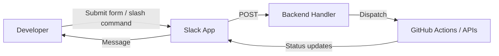

# ChatOps

ChatOps extends DevOps by bringing automation and collaboration into the same space where teams communicate — usually Slack.
Instead of context-switching between terminals and dashboards, developers and operators interact with infrastructure through conversations.
The goal is *transparency, shared ownership, and faster feedback loops.*

## What ChatOps Means in This Project

This demo integrates ChatOps patterns to demonstrate how operational workflows can be **initiated, observed, and audited directly within Slack**.

| Area | ChatOps Role |
|------|---------------|
| **Release Management** | Developers can trigger releases via an interactive Slack modal that dispatches GitHub workflows. |
| **Monitoring & Incident Response** | Scheduled jobs and observability alerts post summarized errors and status updates to Slack channels. |
| **Automation Transparency** | Every triggered workflow or alert is posted to Slack for visibility — creating a shared timeline of operational activity. |
| **Self-Service Infrastructure** | Routine actions (deployments, rollbacks, tag cuts) can be performed without special permissions or terminal access. |

## Why It Matters

- **Reduces Friction** — common operational actions happen in Slack, no need to jump between tools.
- **Shared Context** — everyone sees releases, alerts, and recoveries in one thread.
- **Safety Through Automation** — Slack inputs are validated by backend handlers before triggering CI/CD pipelines.
- **Cultural Alignment with DevOps** — ChatOps reinforces DevOps values: collaboration, transparency, and continuous learning.

## How It Works Here

## Examples in This Demo

- Release Modal – triggers a GitHub Actions workflow_dispatch to cut a new version tag and deploy it.
- Log Watch Alerts – 15-minute scheduler posts error counts and log fingerprints to Slack channels.
- Acknowledgement Commands(TODO) – allow team members to mark alerts as handled directly in Slack threads.

## Future Extensions

- Add approval gates for production releases via Slack buttons.
- Correlate alerts with Grafana dashboards using deep links.

---

**ChatOps** here isn’t another tool — it’s the connective tissue between automation and human awareness.
It turns conversations into action and keeps the operational pulse visible to everyone.
This makes ChatOps stand on its own — philosophically close to DevOps, but documented as *how collaboration and automation blend* in my demo platform.