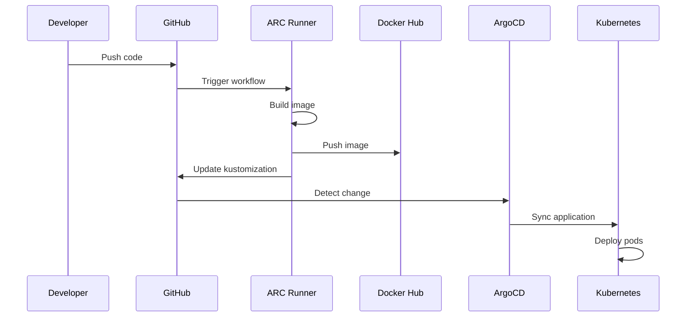

# Kubernetes Deployment

This document describes the GitOps-based deployment workflow for the todo platform, including how code changes flow from GitHub to production.

## Overview

The todo platform uses a fully automated GitOps deployment model powered by:

- **GitHub Actions**: CI/CD pipelines triggered on code changes
- **Self-hosted ARC Runners**: Kubernetes-based GitHub Actions runners
- **DockerHub**: Container image registry
- **ArgoCD**: GitOps continuous deployment
- **Kustomize**: Kubernetes manifest management
- **Slack**: Build and deployment notifications

All deployments are automated, version-controlled, and follow a consistent pattern from code commit to running pods.

## Deployment Architecture



## Components

### GitHub Actions Workflows

Workflows are defined in `.github/workflows/` and trigger on pushes to main that modify specific paths.

Example: `.github/workflows/todo-api.yaml`
```yaml
on:
  push:
    branches: [main]
    paths:
      - 'services/todo-api/**'
      - '.github/workflows/todo-api.yaml'
```

Key workflows:
- `todo-api.yaml`: Build and deploy todo-api service
- `argocd-update.yaml`: Reusable workflow for GitOps updates
- `slack-notification.yaml`: Reusable workflow for Slack notifications

### Self-hosted ARC Runners

**Actions Runner Controller (ARC)** manages GitHub Actions runners inside the Kubernetes cluster.

**Configuration:**
- Location: `deploy/bootstrap/k8s/arc-configuration/gha-runner-scale-set/`
- Namespace: `arc-runners`
- Scale set name: `self-hosted`
- Organization: `https://github.com/scottseotech`
- Scaling: min 2, max 5 runners
- Custom image: Built from `infra/runner/`

**Why self-hosted runners?**
1. In-cluster access to kubectl and kubeconfig
2. Faster builds with cached layers
3. Direct access to cluster services for verification
4. Cost control
5. Security (runs in isolated namespace with specific service account)

**Runner capabilities:**
- Docker-in-Docker (DinD) for building images
- kubectl access for deployment verification
- Git for repository operations
- ArgoCD CLI for triggering syncs

### DockerHub Registry

All container images are pushed to DockerHub under the `curiosinauts` organization.

**Image naming convention:**
```
curiosinauts/scottseotech-<service-name>:<version>
```

Examples:
- `curiosinauts/scottseotech-todo-api:abc1234`
- `curiosinauts/scottseotech-homer:def5678`

**Version tags:**
- Git commit SHA (first 7 characters)
- Ensures exact version traceability

**Registry credentials:**
- Stored as GitHub secrets: `DOCKERHUB_USERNAME`, `DOCKERHUB_TOKEN`
- Injected into runner during workflow execution

### ArgoCD GitOps

**ArgoCD** continuously monitors the Git repository and automatically syncs changes to the cluster.

**Configuration:**
- Namespace: `argocd`
- Applications: Defined in `deploy/argocd-apps/`
- Sync policy: Automatic with self-heal
- Source: This repository (`main` branch)
- Manifests: `deploy/applications/` and `deploy/infrastructure/`

**App-of-Apps Pattern:**
ArgoCD uses an "app-of-apps" pattern where a root application (`argocd-apps`) manages all other applications.

```
argocd-apps (root)
├── todo-api
├── homer
├── cnpg
├── kube-prometheus-stack
├── loki
└── ...
```

### Kustomize

**Kustomize** manages Kubernetes manifests and image versions without templating.

**Structure per application:**
```
deploy/applications/todo-api/
├── kustomization.yaml    # Kustomize config with image reference
├── deployment.yaml        # Base deployment manifest
├── service.yaml           # Service definition
└── ...
```

**Image management:**
Workflows update image versions using:
```bash
kustomize edit set image todo-api=curiosinauts/scottseotech-todo-api:abc1234
```

This modifies `kustomization.yaml` without touching deployment manifests directly.

### ARGOCD_LOCK Mechanism

The lock prevents concurrent deployments from interfering with each other.

**How it works:**
1. Workflow attempts to acquire lock (GitHub repository variable)
2. Lock format: `<app-name>-<run-id>`
3. Retries every 10 seconds for up to 5 minutes
4. Proceeds with deployment if acquired
5. Always releases lock in cleanup step (even on failure)

**Why needed?**
- Prevents race conditions with multiple deployments
- Ensures ArgoCD sync completes before next deployment
- Avoids conflicts in Git repository updates

**Implementation:**
```yaml
- name: Acquire Lock
  run: |
    for i in {1..30}; do
      CURRENT_LOCK=$(gh variable get ARGOCD_LOCK)
      if [ "$CURRENT_LOCK" = "null" ]; then
        gh variable set ARGOCD_LOCK --body "$APP_NAME-$RUN_ID"
        echo "Lock acquired"
        break
      fi
      sleep 10
    done
```

### Slack Notifications

All build and deployment results are posted to the `#builds` Slack channel.

**Notification types:**
- Build started
- Build succeeded
- Build failed
- Deployment succeeded
- Deployment failed

**Information included:**
- Service name
- Version (commit SHA)
- Build duration
- Status (success/failure)
- Links to GitHub run
- Error details (if failed)

**Configuration:**
- Slack bot token: `SLACK_BOT_TOKEN` (GitHub secret)
- Channel: `#builds`
- Workflow: `.github/workflows/slack-notification.yaml`

## Deployment Flow

### Step-by-Step Process

1. **Code Change**
   ```bash
   # Developer makes changes
   git add services/todo-api/
   git commit -m "Add new feature"
   git push origin main
   ```

2. **Workflow Trigger**
   - GitHub detects push to main
   - Checks path filters
   - Queues job for self-hosted runner

3. **Runner Picks Up Job**
   - ARC controller provisions or assigns existing runner pod
   - Runner checks out code
   - Sets up environment

4. **Lock Acquisition**
   ```bash
   # Workflow acquires ARGOCD_LOCK
   LOCK_VALUE="todo-api-123456789"
   gh variable set ARGOCD_LOCK --body "$LOCK_VALUE"
   ```

5. **Docker Build**
   ```bash
   # Build image with commit SHA tag
   VERSION=$(git rev-parse --short HEAD)
   docker build -t curiosinauts/scottseotech-todo-api:$VERSION .
   ```

6. **Docker Push**
   ```bash
   # Push to DockerHub
   docker push curiosinauts/scottseotech-todo-api:$VERSION
   ```

7. **Kustomize Update**
   ```bash
   cd deploy/applications/todo-api
   kustomize edit set image todo-api=curiosinauts/scottseotech-todo-api:$VERSION
   ```

8. **Git Commit**
   ```bash
   git config user.name "github-actions[bot]"
   git add deploy/applications/todo-api/kustomization.yaml
   git commit -m "Update todo-api to version $VERSION"
   git push origin main
   ```

9. **ArgoCD Sync**
   - ArgoCD detects commit
   - Automatically syncs application
   - Applies updated manifests to cluster

10. **Deployment Verification**
    ```bash
    # Wait for deployment to be ready
    kubectl rollout status deployment/todo-api -n default --timeout=5m

    # Verify image version
    DEPLOYED_IMAGE=$(kubectl get deployment todo-api -n default -o jsonpath='{.spec.template.spec.containers[0].image}')
    ```

11. **Lock Release**
    ```bash
    gh variable set ARGOCD_LOCK --body "null"
    ```

12. **Slack Notification**
    - Post success message with version
    - Include links to GitHub run and commit

### Deployment Timeline

Typical deployment takes 3-5 minutes:
- Docker build: 1-2 minutes (with layer caching)
- Docker push: 30 seconds
- Git operations: 10 seconds
- ArgoCD sync: 10 seconds
- Deployment rollout: 30-60 seconds
- Verification: 10 seconds

## Configuration

### Required GitHub Secrets

```yaml
DOCKERHUB_USERNAME: DockerHub username
DOCKERHUB_TOKEN: DockerHub access token
ARGOCD_TOKEN: ArgoCD API token
GH_ACCESS_TOKEN: GitHub PAT for repo operations
SLACK_BOT_TOKEN: Slack bot token for notifications
```

### Required GitHub Variables

```yaml
ARGOCD_LOCK: Deployment coordination lock (managed by workflows)
```

### Service Account Permissions

The ARC runner service account needs:
```yaml
apiVersion: rbac.authorization.k8s.io/v1
kind: Role
metadata:
  name: runner-deploy-verifier
rules:
- apiGroups: ["apps"]
  resources: ["deployments", "statefulsets"]
  verbs: ["get", "list", "watch"]
- apiGroups: [""]
  resources: ["pods"]
  verbs: ["get", "list"]
```

## Best Practices

### DO

- Always use `kustomize edit set image` to update versions
- Let ArgoCD handle all deployments (don't `kubectl apply` manually)
- Wait for deployment stability before releasing lock
- Include meaningful commit messages for version updates
- Monitor #builds channel for deployment status

### DO NOT

- Manually edit image tags in deployment manifests
- Apply changes directly with kubectl (breaks GitOps)
- Skip lock acquisition (causes race conditions)
- Force push to main (breaks version history)
- Use `--force` flags in git or kubectl commands

## Monitoring Deployments

### Check Workflow Status

```bash
# List recent workflow runs
gh run list --repo scottseotech/todo-platform

# View specific run
gh run view <run-id> --repo scottseotech/todo-platform

# View logs
gh run view <run-id> --log --repo scottseotech/todo-platform
```

### Check ArgoCD Status

```bash
# List applications
kubectl get applications -n argocd

# Check specific application
kubectl get application todo-api -n argocd -o yaml

# View sync status
argocd app get todo-api
```

### Check Deployment Status

```bash
# Check deployment
kubectl get deployment todo-api -n default

# Check pods
kubectl get pods -n default -l app=todo-api

# View events
kubectl get events -n default --sort-by='.lastTimestamp'

# Check image version
kubectl get deployment todo-api -n default -o jsonpath='{.spec.template.spec.containers[0].image}'
```

### Check Runner Status

```bash
# List runner pods
kubectl get pods -n arc-runners

# Check runner logs
kubectl logs -n arc-runners <runner-pod-name> -c runner

# View scale set status
kubectl get runners -n arc-runners
```

## Troubleshooting

### Deployment Stuck at Lock Acquisition

**Symptom:** Workflow waiting indefinitely for ARGOCD_LOCK

**Solution:**
```bash
# Check current lock
gh variable get ARGOCD_LOCK --repo scottseotech/todo-platform

# Manually release if stuck
gh variable set ARGOCD_LOCK --body "null" --repo scottseotech/todo-platform
```

### ArgoCD Not Syncing

**Symptom:** Changes committed but ArgoCD not detecting them

**Solution:**
```bash
# Check application status
argocd app get todo-api

# Manual sync
argocd app sync todo-api

# Hard refresh
argocd app sync todo-api --force
```

### Deployment Failed Verification

**Symptom:** Deployment created but pods not running

**Solution:**
```bash
# Check pod status
kubectl get pods -n default -l app=todo-api

# View pod logs
kubectl logs -n default <pod-name>

# Describe pod for events
kubectl describe pod -n default <pod-name>

# Check image pull
kubectl get events -n default | grep -i pull
```

### Runner Not Picking Up Jobs

**Symptom:** Workflows queued but not starting

**Solution:**
```bash
# Check runner pods
kubectl get pods -n arc-runners

# Check runner logs
kubectl logs -n arc-runners <runner-pod-name>

# Verify scale set
kubectl get runnersets -n arc-runners

# Check ARC controller
kubectl logs -n arc-systems deployment/arc-controller-manager
```

### Image Push Failed

**Symptom:** Docker push fails during workflow

**Solution:**
1. Verify DockerHub credentials in GitHub secrets
2. Check DockerHub rate limits
3. Verify network connectivity from runner
4. Check runner disk space:
   ```bash
   kubectl exec -n arc-runners <runner-pod> -- df -h
   ```

### Slack Notification Not Sent

**Symptom:** Deployment completed but no Slack message

**Solution:**
1. Verify SLACK_BOT_TOKEN is valid
2. Check bot is member of #builds channel
3. Review workflow logs for Slack API errors
4. Verify bot has `chat:write` scope

## Rolling Back Deployments

### Option 1: Revert Git Commit

```bash
# Find the commit to revert to
git log deploy/applications/todo-api/kustomization.yaml

# Revert to previous version
git revert <commit-sha>
git push origin main

# ArgoCD will automatically sync the rollback
```

### Option 2: Manual Kustomize Update

```bash
# Update to previous version
cd deploy/applications/todo-api
kustomize edit set image todo-api=curiosinauts/scottseotech-todo-api:<previous-version>

git add kustomization.yaml
git commit -m "Rollback todo-api to <previous-version>"
git push origin main
```

### Option 3: ArgoCD History Rollback

```bash
# View history
argocd app history todo-api

# Rollback to specific revision
argocd app rollback todo-api <revision-number>
```

## Advanced Topics

### Adding New Services

1. Create service directory structure:
   ```bash
   mkdir -p deploy/applications/new-service
   ```

2. Add Kubernetes manifests (deployment, service, etc.)

3. Create kustomization.yaml:
   ```yaml
   apiVersion: kustomize.config.k8s.io/v1beta1
   kind: Kustomization
   resources:
     - deployment.yaml
     - service.yaml
   images:
     - name: new-service
       newName: curiosinauts/scottseotech-new-service
       newTag: latest
   ```

4. Create ArgoCD application:
   ```yaml
   apiVersion: argoproj.io/v1alpha1
   kind: Application
   metadata:
     name: new-service
     namespace: argocd
   spec:
     project: default
     source:
       repoURL: https://github.com/scottseotech/todo-platform
       targetRevision: main
       path: deploy/applications/new-service
     destination:
       server: https://kubernetes.default.svc
       namespace: default
     syncPolicy:
       automated:
         prune: true
         selfHeal: true
   ```

5. Create GitHub workflow following existing patterns

### Customizing Runner Image

Custom runner image is defined in `infra/runner/`:

```dockerfile
FROM summerwind/actions-runner:latest

# Install additional tools
RUN apt-get update && apt-get install -y \
    kubectl \
    argocd-cli \
    kustomize \
    && rm -rf /var/lib/apt/lists/*
```

Build and push:
```bash
cd infra/runner
docker build -t curiosinauts/scottseotech-runner:latest .
docker push curiosinauts/scottseotech-runner:latest
```

Update ARC configuration to use new image.

## Security Considerations

1. **Least Privilege**: Runners have minimal RBAC permissions
2. **Secret Management**: Secrets stored in GitHub, injected at runtime
3. **Network Policies**: Runners isolated in dedicated namespace
4. **Image Scanning**: Consider adding Trivy or similar to workflows
5. **Signed Commits**: Consider requiring GPG signatures
6. **Branch Protection**: Protect main branch, require reviews
7. **Audit Logging**: All deployments tracked in Git history

## Related Documentation

- [Getting Started - Development Setup](../development/getting-started.md)
- [Architecture Overview](../architecture/overview.md)
- [Observability & Troubleshooting](../observability/troubleshooting.md)
