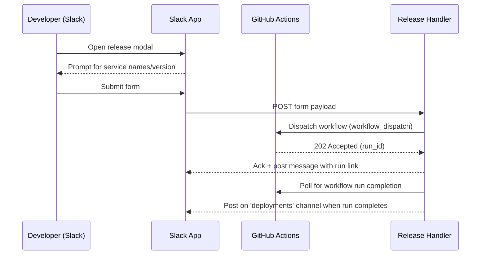

# Slack-Driven Release Management

Releases shouldn’t depend on whoever has the right terminal open.  
Putting a **release modal in Slack** gives developers a safe, auditable, self-service path to kick off the pipeline — right where the team already communicates.  
The result: less handoff friction, clearer visibility, and fewer “who pressed the button?” moments.

## What It Does
- A **Slack interactive modal** collects release inputs (service names, version).
- The modal’s **backend handler** validates the request and invokes a **GitHub Actions release workflow** (e.g., build + publish + deploy).
- Status and links are **echoed back to Slack** for team visibility.

## Where It Fits in DevOps
| Concern | Role of This Capability |
| --- | --- |
| **ChatOps** | Operational action (release) initiated and observed within Slack. |
| **Continuous Delivery / Release Automation** | Triggers a standardized GitHub Actions workflow to perform the actual release. |
| **Developer Self-Service** | Removes bottlenecks; no local tooling or special creds required by devs. |
| **Governance & Audit** | Centralized entry point; who/when/what is captured in Slack and CI logs. |
| **Collaboration** | Real-time visibility of release start/completion in a shared channel. |

## High-Level Flow

