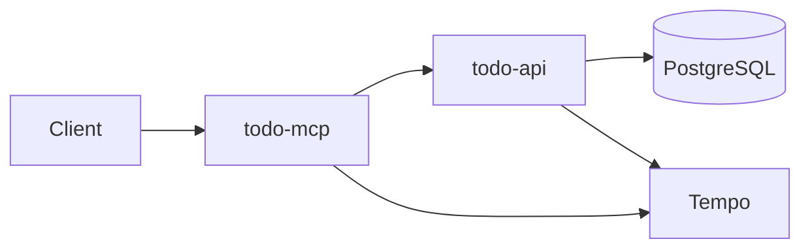

# Todo Platform Documentation

Welcome to the Todo Platform documentation! This is a Kubernetes-based todo application demonstrating modern cloud-native practices including GitOps, observability, and MCP (Model Context Protocol) integration.

## Quick Links

- [Architecture Overview](architecture/overview.md)
- [Getting Started](development/getting-started.md)
- [API Reference](api/todo-api.md)
- [Deployment Guide](deployment/kubernetes.md)

## Features

- **RESTful API** - Todo CRUD operations via todo-api
- **MCP Integration** - AI assistant integration via todo-mcp
- **GitOps Workflow** - ArgoCD for continuous delivery
- **Observability** - OpenTelemetry distributed tracing
- **Self-Hosted CI** - GitHub Actions with ARC runners
- **PostgreSQL** - CloudNativePG operator for database
- **Load Testing** - k6 performance testing

## Architecture

## Getting Started

1. [Set up your local environment](development/local-setup.md)
2. [Build and run services](development/building.md)
3. [Deploy to Kubernetes](deployment/kubernetes.md)

## Services

### todo-api
REST API for todo management built with Go and Gin framework.

- CRUD operations for todos
- OpenTelemetry instrumentation
- GORM database integration

[Learn more →](api/todo-api.md)

### todo-mcp
Model Context Protocol server for AI assistant integration.

- MCP tools for todo operations
- HTTP and SSE transports
- OpenTelemetry distributed tracing

[Learn more →](api/todo-mcp.md)

## Observability

The platform includes comprehensive observability:

- **Traces**: OpenTelemetry → Tempo → Grafana
- **Logs**: Fluent Bit → Loki → Grafana
- **Metrics**: Prometheus → Grafana

[View observability docs →](observability/opentelemetry.md)
