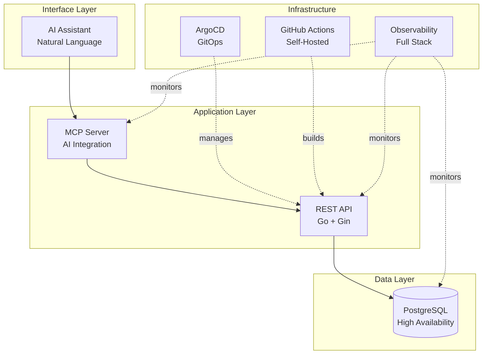

# DevOps Reference Platform

## Overview

The **DevOps Reference Platform** is a demonstration of production-grade infrastructure patterns and practices. This is not a tutorial—it's a fully-functional reference implementation that showcases how modern cloud-native systems are built and operated.

**What this demonstrates:**
- GitOps-driven deployments with ArgoCD
- Self-hosted CI/CD with GitHub Actions Runner Controller
- Full-stack observability (traces, logs, metrics)
- ChatOps for operational workflows
- Infrastructure as Code with Kubernetes operators
- AI integration via Model Context Protocol

**What this is NOT:**
- A step-by-step tutorial
- A production-ready product to clone
- A comprehensive guide to DevOps practices

This platform runs a simple todo application as a reference workload—the value is in the infrastructure, automation, and operational patterns, not the application itself.

## Platform Architecture

## Key Demonstrations

Each component showcases a different production capability:

**AI Integration via Model Context Protocol (MCP)**
The platform uses the emerging MCP standard instead of proprietary AI APIs. Demonstrates: abstraction layers, protocol design, and vendor independence for AI integrations.

**GitOps with ArgoCD**
Deployments happen through Git commits, not manual kubectl commands. Demonstrates: infrastructure as code, declarative configuration, audit trails, and continuous reconciliation.

**Self-Hosted CI/CD Runners**
GitHub Actions runners execute inside the Kubernetes cluster using Actions Runner Controller. Demonstrates: cost optimization, security isolation, in-cluster integration.

**Full-Stack Observability**
OpenTelemetry traces flow from Slack → MCP → API → Database → Grafana. Demonstrates: distributed tracing, W3C trace propagation, metrics collection, and correlation across signals.

**Automated Database Operations**
CloudNativePG handles PostgreSQL high availability, backups, and failover automatically. Demonstrates: Kubernetes operator patterns, stateful workloads, and database reliability.

## Technology Stack

| Layer | Technology | Why It Matters |
|-------|-----------|----------------|
| **Interface** | Slack + OpenAI | Natural language interaction, modern AI integration |
| **Application** | Go, Gin, MCP | Performance, type safety, emerging AI protocols |
| **Data** | PostgreSQL, CloudNativePG | Production-grade database with automated HA |
| **Deployment** | ArgoCD, Kustomize | GitOps workflow, declarative infrastructure |
| **CI/CD** | GitHub Actions (ARC) | Self-hosted runners, cost control, in-cluster access |
| **Observability** | OpenTelemetry, Tempo, Loki, Prometheus | End-to-end tracing, full telemetry stack |

## Reference Workload: Todo Application

The platform runs a simple todo list application to anchor the infrastructure demonstrations:

- **Backend**: Go REST API with PostgreSQL (CloudNativePG)
- **AI Integration**: MCP server for natural language operations via Slack
- **Interface**: Slack ChatOps for operational control and user interaction

The application is intentionally minimal—complex enough to demonstrate database operations, API patterns, distributed tracing, and AI integration, but simple enough to keep focus on the platform capabilities rather than application logic.

## Explore the Platform

**[Architecture Overview →](architecture/overview.md)**
Detailed system design with component descriptions and data flows.

**[Deployment Documentation →](deployment/kubernetes.md)**
See how GitOps, self-hosted runners, and ArgoCD work together for automated deployments.

**[Observability Stack →](observability/observability.md)**
Explore how distributed tracing connects requests from Slack to the database.

**[Development Setup →](development/getting-started.md)**
Run the platform locally with hot reloading and development tools.

## Why This Platform Exists

Building a todo app is simple. Building a **reference platform** that demonstrates:

- AI integration without vendor lock-in
- Automated deployments with zero downtime
- Debugging distributed systems in production
- Managing stateful workloads reliably

...that's what separates platform engineers from application developers.

This platform demonstrates those skills through working infrastructure, not theoretical explanations.
