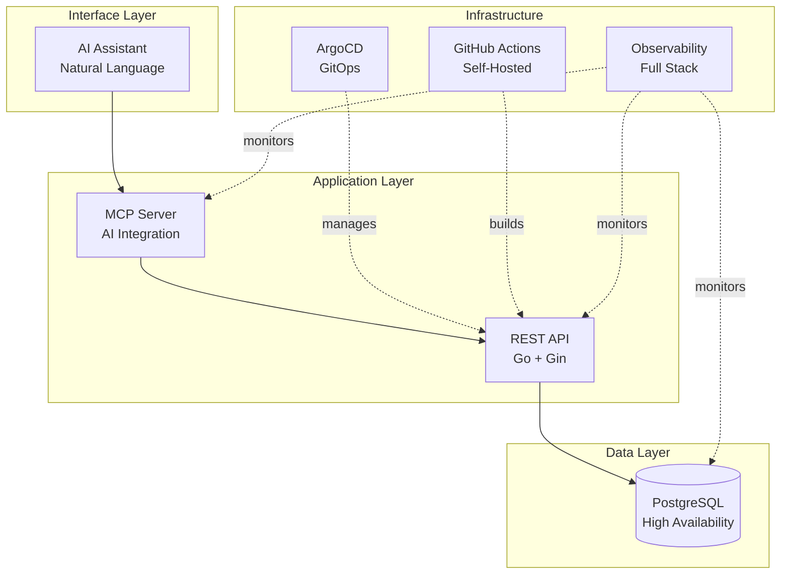

# Building Production-Grade Systems

## The Challenge

Modern applications need more than just working code—they need **reliability at scale**, **observable behavior**, and **automated operations**. This platform demonstrates how to build a production-ready system that handles the complexity of cloud-native infrastructure while maintaining developer velocity.

## What This Platform Demonstrates

This is a **fully-instrumented Kubernetes application** that shows how different pieces of production infrastructure work together:

## Key Technical Decisions

Each component was chosen to demonstrate a different production skill:

**AI Integration via Model Context Protocol (MCP)**
Instead of hard-coding AI features, this uses the emerging MCP standard. Shows understanding of: abstraction layers, protocol design, and future-proofing integrations.

**GitOps with ArgoCD**
Deployments happen through Git commits, not manual kubectl commands. Demonstrates: infrastructure as code, declarative configuration, and audit trails.

**Self-Hosted CI/CD Runners**
GitHub Actions runners run inside the Kubernetes cluster using Actions Runner Controller. Shows: cost optimization, security isolation, and in-cluster integration.

**Full-Stack Observability**
OpenTelemetry traces flow from Slack(TODO) → MCP → API → Database → Grafana. Demonstrates: distributed tracing, correlation IDs(TODO), metrics collection, and debugging production systems.

**Automated Database Operations**
CloudNativePG handles PostgreSQL high availability, backups, and failover automatically. Shows: operator patterns, stateful workloads, and database reliability.

## Technology Stack

| Layer | Technology | Why It Matters |
|-------|-----------|----------------|
| **Interface** | Slack + OpenAI | Natural language interaction, modern AI integration |
| **Application** | Go, Gin, MCP | Performance, type safety, emerging AI protocols |
| **Data** | PostgreSQL, CloudNativePG | Production-grade database with automated HA |
| **Deployment** | ArgoCD, Kustomize | GitOps workflow, declarative infrastructure |
| **CI/CD** | GitHub Actions (ARC) | Self-hosted runners, cost control, in-cluster access |
| **Observability** | OpenTelemetry, Tempo, Loki, Prometheus | End-to-end tracing, full telemetry stack |

## Explore the Architecture

**[Architecture Overview →](architecture/overview.md)**
See the full system design with detailed component descriptions and data flows.

**[Deployment Guide →](deployment/kubernetes.md)**
Learn how GitOps, self-hosted runners, and ArgoCD work together for automated deployments.

**[Observability Stack →](observability/observability.md)**
Understand how distributed tracing connects requests from Slack to the database.

**[Development Setup →](development/getting-started.md)**
Get the platform running locally with hot reloading and development tools.

## Why This Matters

Building a todo app is simple. Building a **production-ready platform** that demonstrates:

- How to integrate AI without vendor lock-in
- How to automate deployments with zero downtime
- How to debug distributed systems in production
- How to manage stateful workloads reliably

...that's what separates senior engineers from the rest.

This platform shows those skills in action.
