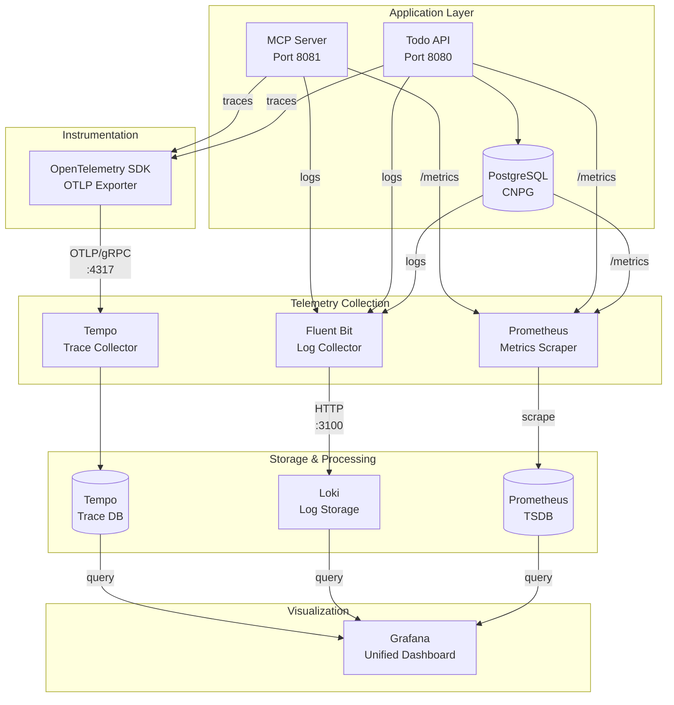

# Observability

## Why Observability Matters

Production systems fail in unexpected ways. **Observability** - the ability to understand internal system state from external outputs - is what separates systems that are debuggable from those that aren't.

This platform implements the **three pillars of observability** with full integration:

- **Traces**: Follow requests across services (MCP → API → Database)
- **Logs**: Centralized log aggregation with full-text search
- **Metrics**: Time-series data for performance and health monitoring

All telemetry flows to Grafana for unified visualization and correlation.

## The Stack

| Component | Purpose | What It Demonstrates |
|-----------|---------|---------------------|
| **OpenTelemetry** | Instrumentation SDK | Vendor-neutral observability, W3C trace propagation |
| **Tempo** | Trace storage | Distributed tracing backend, correlation with logs |
| **Loki** | Log aggregation | Cost-effective log storage, label-based querying |
| **Prometheus** | Metrics collection | Time-series monitoring, alerting rules |
| **Grafana** | Visualization | Unified dashboards, trace/log/metric correlation |

## Observability Architecture



**Data Flow:**

- **Traces**: Applications emit OTLP traces → Tempo → Grafana
- **Logs**: Applications write JSON logs → Fluent Bit → Loki → Grafana
- **Metrics**: Applications expose `/metrics` → Prometheus scrapes → Grafana

All three signals are correlated(TODO) in Grafana by trace ID for unified debugging.

## OpenTelemetry Implementation

OpenTelemetry provides vendor-neutral instrumentation for traces, logs, and metrics.

??? note "Trace Propagation"
    **W3C Trace Context** propagates trace IDs across service boundaries:

    ```
    SlackBot → MCP Server → API → Database
       ↓           ↓         ↓ 
    TraceID: abc123 (same across all services) (TODO)
    ```

    Each service extracts the trace context from incoming requests and injects it into outgoing requests.

    **Implementation:**

    ```go
    // In todo-api and todo-mcp
    import "go.opentelemetry.io/otel"

    // Extract context from incoming HTTP request
    ctx := otel.GetTextMapPropagator().Extract(r.Context(), propagation.HeaderCarrier(r.Header))

    // Start a new span with extracted context
    ctx, span := tracer.Start(ctx, "operation-name")
    defer span.End()
    ```

??? note "Exporter Configuration"
    Traces are exported via **OTLP/gRPC** to Tempo:

    ```go
    exporter, err := otlptracegrpc.New(ctx,
        otlptracegrpc.WithEndpoint("tempo:4317"),
        otlptracegrpc.WithInsecure(),
    )

    tp := sdktrace.NewTracerProvider(
        sdktrace.WithBatcher(exporter),
        sdktrace.WithResource(resource.NewWithAttributes(
            semconv.ServiceNameKey.String("todo-api"),
        )),
    )
    ```

    **Configuration:**
    - **Endpoint**: Tempo collector on port 4317
    - **Protocol**: OTLP/gRPC
    - **Batching**: 5-second interval or 512 spans
    - **Sampling**: 100% (all traces recorded)

??? note "Adding Custom Spans"
    Create spans for important operations:

    ```go
    func CreateTodo(ctx context.Context, title string) error {
        ctx, span := tracer.Start(ctx, "CreateTodo")
        defer span.End()

        span.SetAttributes(
            attribute.String("todo.title", title),
            attribute.String("user.id", userID),
        )

        // Business logic here
        if err != nil {
            span.RecordError(err)
            span.SetStatus(codes.Error, "failed to create todo")
            return err
        }

        span.AddEvent("todo_created", trace.WithAttributes(
            attribute.Int("todo.id", todoID),
        ))

        return nil
    }
    ```

??? note "Performance Tuning"
    **Sampling:**
    For high-traffic production, reduce sampling:
    ```go
    sdktrace.WithSampler(sdktrace.ParentBased(
        sdktrace.TraceIDRatioBased(0.1), // Sample 10% of traces
    ))
    ```

    **Batch Processing:**
    ```go
    sdktrace.WithBatcher(exporter,
        sdktrace.WithBatchTimeout(5*time.Second),
        sdktrace.WithMaxExportBatchSize(512),
    )
    ```

    **High Overhead?**
    - Reduce sampling rate
    - Increase batch timeout
    - Disable stdout exporter in production

## Tempo - Distributed Tracing

Tempo stores and queries distributed traces from OpenTelemetry.

??? note "Configuration"
    - **Storage**: Local filesystem (configurable for S3/GCS)
    - **Ingestion**: OTLP/gRPC on port 4317
    - **Query**: Grafana Tempo data source
    - **Retention**: Configurable based on storage

??? note "Querying Traces"
    **In Grafana:**
    1. Navigate to Explore
    2. Select Tempo data source
    3. Search by:
        - Trace ID
        - Service name
        - Duration
        - Tags/attributes

    **Example queries:**
    - Find slow requests: `{duration > 1s}`
    - Find errors: `{status = error}`
    - By service: `{service.name = "todo-api"}`

## Loki - Log Aggregation

Centralized log collection with S3 storage backend.

??? note "Log Collection"
    **Fluent Bit** agents ship logs to Loki:

    - Collects structured logs from all services
    - Parses JSON log format
    - Adds Kubernetes metadata (pod, namespace, labels)
    - Ships to Loki gateway

??? note "Storage"
    - **Backend**: MinIO S3-compatible storage
    - **Retention**: Configurable based on S3 lifecycle policies
    - **Compression**: Optimized for cost-effective long-term storage

??? note "Querying Logs"
    **LogQL query examples:**
    ```logql
    # All logs from todo-api
    {app="todo-api"}

    # Errors only
    {app="todo-api"} |= "error"

    # Specific trace ID
    {app="todo-api"} | json | trace_id="abc123"

    # Rate of errors
    sum(rate({app="todo-api"} |= "error" [5m]))
    ```

## Prometheus - Metrics

Time-series metrics collection and alerting.

??? note "Scraping Configuration"
    Prometheus scrapes metrics every 15 seconds:

    - **Todo API**: Go runtime metrics, HTTP request metrics
    - **Todo MCP**: Go runtime metrics, MCP operation metrics
    - **PostgreSQL**: Database performance, replication lag, connection pool stats

??? note "Available Metrics"
    **Go Runtime:**
    - `go_goroutines` - Number of goroutines
    - `go_memstats_alloc_bytes` - Memory allocated
    - `go_gc_duration_seconds` - GC pause duration

    **HTTP:**
    - `http_requests_total` - Request counter
    - `http_request_duration_seconds` - Request latency
    - `http_requests_in_flight` - Concurrent requests

    **PostgreSQL:**
    - `cnpg_pg_replication_lag` - Replication lag
    - `cnpg_pg_database_size_bytes` - Database size
    - `cnpg_pg_stat_database_blks_read` - Disk reads

## Grafana - Unified Dashboard

Single pane of glass for traces, logs, and metrics.

??? note "Data Sources"
    - **Prometheus**: Metrics and alerts
    - **Tempo**: Distributed traces
    - **Loki**: Log aggregation

??? note "Trace-to-Log Correlation(TODO)"
    Click on a trace span in Grafana to see associated logs:

    1. View trace in Tempo
    2. Click on a span
    3. See "Logs for this span" link
    4. Automatically queries Loki with matching trace ID

    This demonstrates how to correlate telemetry for debugging.

??? note "Alerting"
    Alerts route to Slack `#alerts` channel:

    - error log patterns are used to aggregate same type of logs to include counts in alerts

## Troubleshooting Observability

Verify telemetry is flowing correctly.

??? note "Test Trace Propagation Locally"
    **1. Start services with stdout tracing:**
    ```bash
    export OTEL_ENABLE_STDOUT=true
    cd services/todo-api && go run main.go
    cd services/todo-mcp && go run main.go
    ```

    **2. Trigger a request:**
    ```bash
    curl -X POST http://localhost:8081/tools/todos-add/invoke \
        -H "Content-Type: application/json" \
        -d '{"arguments": {"title": "Test trace", "due_date": "2025-11-01T10:00:00Z"}}'
    ```

    **3. Verify trace IDs match:**
    Check stdout output from both services - trace ID should be identical.

??? note "Test Against Kubernetes"
    **1. Port forward to MCP service:**
    ```bash
    kubectl port-forward -n default svc/todo-mcp 8081:8081
    ```

    **2. Trigger test request:**
    ```bash
    curl -X POST http://localhost:8081/tools/todos-add/invoke \
        -H "Content-Type: application/json" \
        -d '{"arguments": {"title": "Test K8s trace", "due_date": "2025-11-01T10:00:00Z"}}'
    ```

    **3. View trace in Grafana:**
    - Port forward Grafana: `kubectl port-forward -n monitoring svc/kube-prometheus-stack-grafana 3000:80`
    - Navigate to Explore → Tempo
    - Search for recent traces from `todo-mcp`

??? note "Common Issues"
    **No traces appearing:**
    - Check Tempo endpoint: `kubectl logs -n monitoring deployment/tempo`
    - Verify OTLP endpoint: Should be `tempo:4317`
    - Check exporter config in service logs

    **Trace IDs don't match:**
    - Verify W3C trace context propagation
    - Check HTTP header injection/extraction
    - Ensure context is passed through function calls

    **High overhead:**
    - Enable sampling: Reduce to 10% or lower
    - Increase batch timeout
    - Disable stdout exporter

## Best Practices

1. **Always propagate context** - Pass `context.Context` through all function calls
2. **Use descriptive span names** - `CreateTodo` not `Handler`
3. **Add meaningful attributes** - Include IDs, user info, business context
4. **Record errors** - Always call `span.RecordError(err)` on errors
5. **Set span status** - Use `codes.Ok` or `codes.Error`
6. **Keep spans focused** - One logical operation per span
7. **Avoid sensitive data** - Don't include passwords, tokens in attributes
8. **Use correlation** - Link traces to logs with trace IDs

## References

- [OpenTelemetry Go Documentation](https://opentelemetry.io/docs/languages/go/)
- [OTLP Specification](https://opentelemetry.io/docs/specs/otlp/)
- [Grafana Tempo](https://grafana.com/docs/tempo/latest/)
- [W3C Trace Context](https://www.w3.org/TR/trace-context/)
- [Prometheus Best Practices](https://prometheus.io/docs/practices/)
- [LogQL Syntax](https://grafana.com/docs/loki/latest/logql/)
