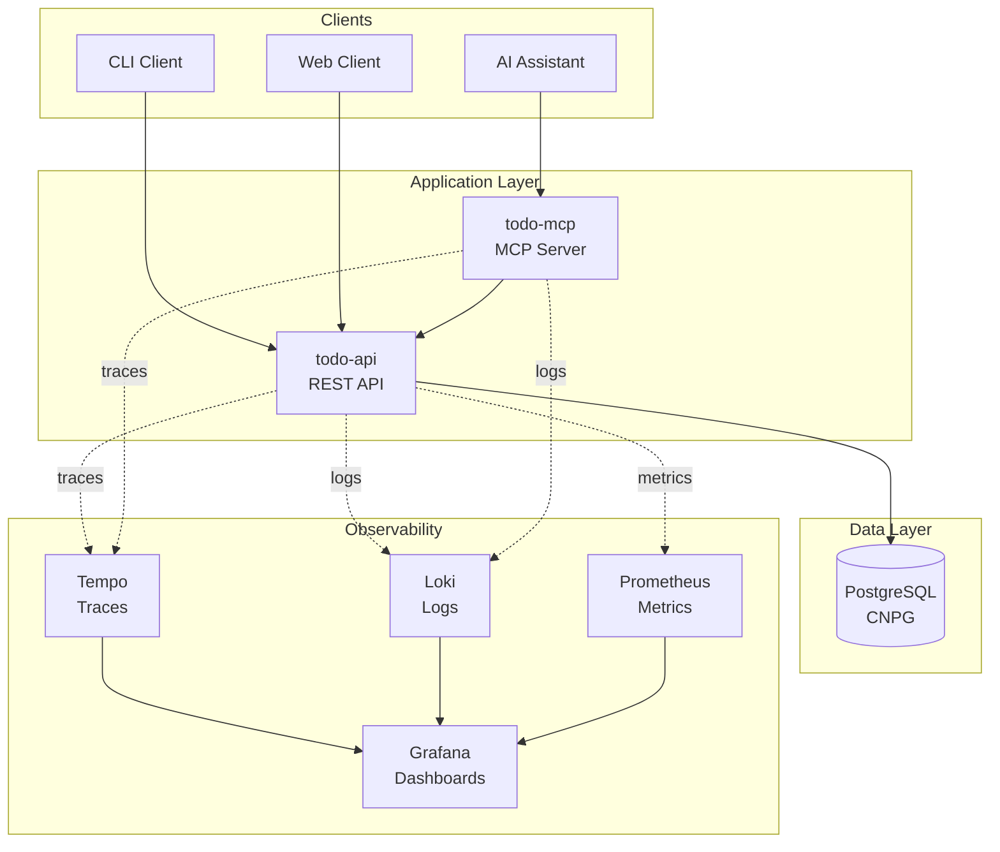
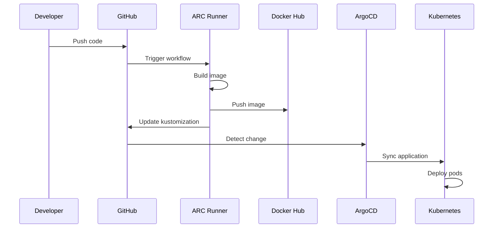

# Architecture Overview

The Todo Platform is a cloud-native application built on Kubernetes with a focus on GitOps, observability, and modern development practices.

## System Architecture



## Key Components

### Application Services

#### todo-api
RESTful API service providing CRUD operations for todos.

- **Language**: Go
- **Framework**: Gin
- **Database**: PostgreSQL via GORM
- **Port**: 8080

#### todo-mcp
Model Context Protocol server enabling AI assistant integration.

- **Language**: Go
- **Framework**: MCP SDK
- **Transports**: HTTP, SSE
- **Port**: 8081

### Infrastructure

#### CloudNativePG (CNPG)
PostgreSQL operator managing database lifecycle.

- **Cluster**: todo-db (2 replicas)
- **Backups**: Automated to MinIO
- **Connection**: `todo-db-rw.cnpg.svc.cluster.local`

#### ArgoCD
GitOps continuous delivery tool.

- **Pattern**: App of Apps
- **Sync**: Automatic with health checks
- **Pruning**: Enabled

#### GitHub Actions Runner Controller (ARC)
Self-hosted CI/CD runners.

- **Scale**: Min 2, Max 5
- **Scope**: Organization-level
- **Image**: Custom with Docker, kubectl, k6

### Observability Stack

#### OpenTelemetry
Instrumentation for distributed tracing.

- **Exporters**: OTLP/gRPC to Tempo
- **Propagation**: W3C Trace Context
- **SDK**: Go OpenTelemetry

#### Tempo
Distributed tracing backend.

- **Storage**: Local filesystem
- **Query**: Grafana integration
- **Retention**: Configurable

#### Grafana
Unified observability dashboard.

- **Data Sources**: Tempo, Loki, Prometheus
- **Dashboards**: Pre-configured
- **Alerts**: Prometheus AlertManager

## Deployment Model

### GitOps Flow



### Image Build Pipeline

1. Code pushed to `services/*/` triggers workflow
2. Self-hosted runner builds Docker image
3. Image tagged with git commit SHA
4. Pushed to Docker Hub
5. Kustomization updated with new tag
6. ArgoCD syncs deployment

## Network Architecture

### Service Mesh

```
┌─────────────────────────────────────┐
│         Ingress (Future)            │
└──────────────┬──────────────────────┘
               │
    ┌──────────┴──────────┐
    │                     │
┌───▼────┐          ┌────▼────┐
│todo-mcp│          │todo-api │
│  :8081 │          │  :8080  │
└───┬────┘          └────┬────┘
    │                    │
    └──────────┬─────────┘
               │
        ┌──────▼──────┐
        │ PostgreSQL  │
        │   :5432     │
        └─────────────┘
```

### DNS Resolution

- Internal: `<service>.<namespace>.svc.cluster.local`
- Example: `todo-api.default.svc.cluster.local`

## Security

### Secrets Management

- **Database credentials**: Kubernetes Secrets
- **Docker Hub**: GitHub Secrets
- **ArgoCD token**: GitHub Secrets

### Network Policies

- Services isolated by namespace
- Database accessible only from app pods
- Observability in separate namespace

## Scalability

### Horizontal Scaling

- **todo-api**: Stateless, scales easily
- **todo-mcp**: Stateless, scales easily
- **PostgreSQL**: Primary/replica via CNPG

### Resource Limits

```yaml
resources:
  limits:
    memory: "256Mi"
    cpu: "500m"
  requests:
    memory: "128Mi"
    cpu: "100m"
```

## High Availability

- **Database**: 2 replicas with automatic failover
- **Backups**: Daily to MinIO S3
- **Monitoring**: Prometheus alerts
- **Health checks**: Kubernetes liveness/readiness probes
